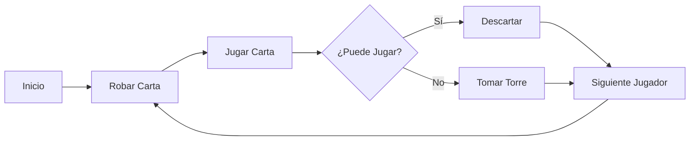

# 🃏 Reglamento Completo - Torre de los Pecados

*Un clásico juego de cartas chileno ambientado en un universo de fantasía*

---

## 📖 Introducción

> **🏰 La Torre de los Pecados** es más que un simple juego de cartas. Es una batalla épica entre criaturas mágicas donde la estrategia, la suerte y la temática de fantasía se combinan para crear una experiencia única.

El objetivo es deshacerse de todas tus criaturas mágicas para no ser el último y, por lo tanto, el **"Pecador"** que cargará con la culpa de la "Torre de los Pecados".

### 🎭 Ambientación
- **Universo**: Fantasía medieval con elementos celestiales e infernales
- **Temática**: Virtudes vs Pecados, Dragones ancestrales, Magia arcana
- **Estilo**: Juego de cartas estratégico con elementos narrativos

---

## 🎯 Objetivo del Juego

### 🏆 **Victoria**
El primer jugador en deshacerse de **todas sus criaturas** (mano, boca arriba y boca abajo)

### 💀 **Derrota** 
El último jugador en quedarse con criaturas es el **"Pecador"**

### ⚖️ **Castigo**
El perdedor debe cargar con la "Torre de los Pecados" hasta la próxima partida

---

## 🃏 Preparación del Juego

### 📦 Componentes Necesarios

| Componente | Cantidad | Descripción |
|------------|----------|-------------|
| 🃏 Baraja | 1 | 52 cartas (sin Jokers) |
| 👥 Jugadores | 2-6 | Mínimo 2, máximo 6 |
| 🎲 Dados | Opcional | Para variantes |

### 🎮 Configuración Inicial

<strong>📋 Pasos de Preparación</strong>

1. **🃏 Baraja**: Se usa una baraja de 52 cartas, donde cada naipe representa una criatura mágica con un valor (del 1 al 13, siendo el 1 el As y el 13 el Rey)

2. **🎯 Reparto**: Se reparten **12 cartas** (criaturas) a cada jugador

3. **📐 Organización de las Criaturas**:
   - Cada jugador toma **3 criaturas** de su mano y las coloca **boca arriba** frente a él
   - Luego, coloca otras **3 criaturas boca abajo** encima de las anteriores
   - Las criaturas restantes forman el mazo de robo, o el **"Pozo de Almas"**, y se colocan boca abajo en el centro de la mesa

---

## 🎮 Cómo Jugar

### 🔄 Turno Básico

**🔄 Flujo del Juego**

#### 📝 Pasos del Turno

1. **🎯 Objetivo**: Descartar criaturas de tu mano en la **"Torre de los Pecados"** (mazo de descarte)
2. **🚀 Primer Jugador**: Puede descartar cualquier criatura
3. **⚖️ Jugadores Siguientes**: Deben descartar una criatura de **igual o mayor valor** que la última jugada

### 📜 Reglas de Descarte

> ⚠️ **Regla Principal**: Si no puedes jugar una criatura de valor igual o superior, debes llevarte **todas las criaturas** de la "Torre de los Pecados" a tu mano.

#### 🧹 Purificación del Mazo

| Condición | Efecto |
|-----------|--------|
| **Carta idéntica** (ej: 5 sobre 5) | ✅ **Purifica** - Torre se retira del juego |
| **4 cartas del mismo valor** | ✅ **Purifica** - Torre se retira del juego |
| **Carta 10** | ✅ **Purifica** - Torre se retira del juego |

#### 🔄 Robo de Cartas
- Cada vez que descartas una criatura de tu mano, robas una nueva del **"Pozo de Almas"**
- Mantienes siempre la misma cantidad de cartas en tu mano (generalmente 3)

---

## 🔄 Fases del Juego

El juego se desarrolla en **tres fases** progresivas:

### 📊 Tabla de Fases

| Fase | Cartas Disponibles | Robo | Descripción |
|------|-------------------|------|-------------|
| **🖐️ Fase de la Mano** | Mano (3 cartas) | ✅ Sí | Juegas con las criaturas de tu mano |
| **👁️ Fase Boca Arriba** | Boca arriba (3 cartas) | ❌ No | Juegas con las criaturas visibles |
| **❓ Fase Boca Abajo** | Boca abajo (3 cartas) | ❌ No | Juegas sin ver las criaturas |

### 📋 Detalles por Fase

<strong>🖐️ Fase de la Mano</strong>

- **Cartas**: Las 3 criaturas en tu mano
- **Robo**: ✅ Después de cada descarte
- **Estrategia**: Gestiona tu mano para mantener opciones

<strong>👁️ Fase Boca Arriba</strong>

- **Cartas**: Las 3 criaturas boca arriba
- **Robo**: ❌ No puedes robar del "Pozo de Almas"
- **Estrategia**: Usa las cartas visibles estratégicamente

<strong>❓ Fase Boca Abajo</strong>

- **Cartas**: Las 3 criaturas boca abajo (sin ver)
- **Robo**: ❌ No puedes robar
- **Estrategia**: Juegas a ciegas, si no es válida tomas toda la Torre y regresas a la Fase de la Mano

---

## ⚡ Reglas Especiales

### 🃏 Criaturas con Poderes Especiales

**🎯 Cartas Especiales: 2, 8 y 10**

#### 🃏 La Criatura del 2 (Poder Universal)

> **🌟 Efecto**: Se puede jugar sobre **cualquier criatura**. El siguiente jugador puede jugar **lo que quiera**.

| Mazo | Criatura | Descripción |
|------|----------|-------------|
| 👼 **Ángeles** | El Serafín de la Fe | Purifica el mazo de descarte |
| 😈 **Demonios** | Demonio de la Ira | Furia incontrolable |
| 🐉 **Dragones** | El Dragón de la Peste | Escupe veneno |
| 🧙‍♂️ **Magos** | El Ilusionista | Conjura cualquier truco |

#### ⏭️ La Criatura del 8 (Poder de Salto)

> **⏭️ Efecto**: **Salta al siguiente jugador**, como en el juego del UNO. El jugador siguiente al saltado pierde su turno.

| Mazo | Criatura | Descripción |
|------|----------|-------------|
| 👼 **Ángeles** | El Emisario de la Fe y la Caridad | Transmite mensajes divinos |
| 😈 **Demonios** | Portador de la Pestilencia | Propaga enfermedades |
| 🐉 **Dragones** | El Dragón Etéreo | Atraviesa la realidad |
| 🧙‍♂️ **Magos** | El Mago del Tiempo | Manipula el tiempo |

#### ✨ La Criatura del 10 (Poder de Purificación)

> **🧹 Efecto**: Puede **purificar** la "Torre de los Pecados". El siguiente jugador comienza una nueva ronda.

| Mazo | Criatura | Descripción |
|------|----------|-------------|
| 👼 **Ángeles** | El Trono de la Virtud | Limpia la Torre con poder divino |
| 😈 **Demonios** | Señor del Abismo | Destruye la Torre con una palabra |
| 🐉 **Dragones** | El Dragón Dorado | Incinera la Torre con su aliento |
| 🧙‍♂️ **Magos** | El Archimago de la Destrucción | Anula toda la Torre con magia |

---

## 🎨 Mazos Temáticos

Cada mazo representa un tema de fantasía con **13 criaturas únicas**, cada una con poderes especiales y personalidades distintivas.

### 📊 Resumen de Mazos

| Mazo | Tema | Estilo | Dificultad |
|------|------|--------|------------|
| 👼 **Ángeles** | Virtudes Celestiales | Defensivo/Control | ⭐⭐ |
| 😈 **Demonios** | Pecados Capitales | Agresivo/Caos | ⭐⭐⭐ |
| 🐉 **Dragones** | Poder Primitivo | Fuerza Bruta | ⭐⭐ |
| 🧙‍♂️ **Magos** | Magia Arcana | Control/Manipulación | ⭐⭐⭐⭐ |

---

### 👼 Mazo de Ángeles

**🌟 Virtudes Celestiales - La Luz Divina**

| Valor | Criatura | Virtud | Descripción |
|-------|----------|--------|-------------|
| **As (1)** | El Querubín de la Esperanza | Esperanza | El primer destello de luz, guía en los comienzos inciertos |
| **Dos (2)** | El Serafín de la Fe | Fe | Su pureza refuerza el corazón de los justos |
| **Tres (3)** | El Guardián de la Caridad | Caridad | Protege a los más débiles, dispuesto a sacrificarse |
| **Cuatro (4)** | La Cohorte de la Prudencia | Prudencia | Legión sabia que planea cada movimiento |
| **Cinco (5)** | El Portador de la Justicia | Justicia | Porta la balanza divina, equilibrando las fuerzas |
| **Seis (6)** | El Arcángel de la Fortaleza | Fortaleza | Su armadura resplandece con fuerza inquebrantable |
| **Siete (7)** | La Llama de la Templanza | Templanza | Modera los excesos, neutraliza habilidades extremas |
| **Ocho (8)** | El Emisario de la Fe y la Caridad | Fe + Caridad | Fortalece la unión entre aliados |
| **Nueve (9)** | El Serafín de la Justicia Suprema | Justicia elevada | Su balanza brilla más que cualquier otra |
| **Diez (10)** | El Trono de la Virtud | Todas las virtudes | Máxima expresión de la perfección celestial |
| **Jota (11)** | El Arcángel de la Estrategia | Prudencia + Fortaleza | Dirige legiones con sabiduría y valor |
| **Reina (12)** | La Bendición de la Caridad | Caridad + Esperanza | Irradia luz sanadora, protegiendo a los caídos |
| **Rey (13)** | El Creador de la Luz | Fe + Esperanza + Caridad | La divinidad suprema, origen de todo |

---

### 😈 Mazo de Demonios

**🔥 Pecados Capitales - La Oscuridad del Abismo**

| Valor | Criatura | Pecado/Círculo | Descripción |
|-------|----------|----------------|-------------|
| **As (1)** | Larva de la Avaricia | Avaricia / 4° círculo | Se alimenta del oro y del deseo |
| **Dos (2)** | Demonio de la Ira | Ira / 5° círculo | Encarnación del odio ardiente |
| **Tres (3)** | Espectro de la Envidia | Envidia / 2° círculo | Drena el poder de los demás |
| **Cuatro (4)** | Súcubo de la Lujuria | Lujuria / 2° círculo | Esclaviza las mentes con engaños |
| **Cinco (5)** | Goliat de la Pereza | Pereza / 3° círculo | Gigante lento, poder inesperado |
| **Seis (6)** | Glotón del Abismo | Gula / 3° círculo | Bestia que devora aliados y enemigos |
| **Siete (7)** | Incubo de la Lujuria | Lujuria / 2° círculo | Complemento del súcubo |
| **Ocho (8)** | Portador de la Pestilencia | Herejía / 6° círculo | Siembra plagas, infecta criaturas |
| **Nueve (9)** | Tirano de la Soberbia | Soberbia / 1° círculo | Se cree superior a sus iguales |
| **Diez (10)** | Señor del Abismo | Traición / 9° círculo | Demonio primordial, quebranta vínculos |
| **Jota (11)** | Barón de las Sombras | Violencia / 7° círculo | Maestro del sigilo y manipulación |
| **Reina (12)** | La Bruja del Caos | Malebolge / 8° círculo | Controla corrupción y desorden |
| **Rey (13)** | El Emperador del Infierno | Lucifer / 9° círculo | Ser supremo del inframundo |

---

### 🐉 Mazo de Dragones

**🔥 Poder Primitivo - Los Señores del Cielo**

| Valor | Criatura | Elemento | Descripción |
|-------|----------|----------|-------------|
| **As (1)** | El Dragón Bebé | - | Recién salido del cascarón, anuncia su destino |
| **Dos (2)** | El Dragón de la Peste | Veneno | Su aliento envenenado corrompe el aire |
| **Tres (3)** | El Dragón de Piedra | Tierra | De escamas pétreas, casi indestructible |
| **Cuatro (4)** | El Dragón de Hielo | Hielo | Congela todo a su paso, ralentiza |
| **Cinco (5)** | El Dragón de Bronce | Metal | Noble guerrero que lucha con honor |
| **Seis (6)** | El Dragón de las Colinas | Tierra | Salvaje y territorial, protege dominios |
| **Siete (7)** | El Dragón del Desierto | Arena | Astuto y paciente, maestro del engaño |
| **Ocho (8)** | El Dragón Etéreo | Etéreo | Espectro que atraviesa dimensiones |
| **Nueve (9)** | El Dragón de la Tormenta | Tormenta | Desde las nubes lanza rayos devastadores |
| **Diez (10)** | El Dragón Dorado | Fuego | Símbolo de perfección, arrasa la Torre |
| **Jota (11)** | El Dragón de Jade | Sabiduría | Antiguo y sabio, guardián de secretos |
| **Reina (12)** | La Dracona Guardiana | Protección | Madre protectora de la estirpe |
| **Rey (13)** | El Dragón Primigenio | Origen | El primero de todos los dragones |

---

### 🧙‍♂️ Mazo de Magos

**✨ Magia Arcana - Los Maestros del Arcano**

| Valor | Criatura | Especialización | Descripción |
|-------|----------|-----------------|-------------|
| **As (1)** | El Aprendiz de Mago | Inicio | Inexperto pero lleno de curiosidad |
| **Dos (2)** | El Ilusionista | Ilusiones | Maestro de engaños y confusión |
| **Tres (3)** | El Invocador de Golems | Invocación | Crea constructos de piedra |
| **Cuatro (4)** | El Alquimista del Destino | Alquimia | Manipula elementos y materia |
| **Cinco (5)** | El Nigromante de las Sombras | Nigromancia | Controla a los muertos |
| **Seis (6)** | El Hechicero de la Tormenta | Tormentas | Domina rayos, truenos y huracanes |
| **Siete (7)** | El Vidente del Futuro | Adivinación | Profeta que ve lo que está por venir |
| **Ocho (8)** | El Mago del Tiempo | Tiempo | Dueño de las arenas temporales |
| **Nueve (9)** | El Maestro de los Elementos | Elementos | Control absoluto de fuego, agua, tierra y aire |
| **Diez (10)** | El Archimago de la Destrucción | Destrucción | Poder cataclísmico, desintegra la Torre |
| **Jota (11)** | El Mago de las Runas | Runas | Descifra símbolos ancestrales |
| **Reina (12)** | La Oráculo de las Estrellas | Cosmología | Conecta con el cosmos y constelaciones |
| **Rey (13)** | El Mago Supremo | Supremacía | Origen y cúspide de la magia |

---

## 🎭 Temática de los Mazos

### 👼 Mazo de Ángeles

> **🌟 Reino Celestial**: Las virtudes se manifiestan como seres angelicales que descienden al plano terrenal cuando el equilibrio del mundo se rompe.

#### 📊 Estructura Temática

| Nivel | Cartas | Virtudes | Función |
|-------|--------|----------|---------|
| **🌱 Inicio** | 1-3 | Teologales (Esperanza, Fe, Caridad) | Pilares iniciales de la moral |
| **⚖️ Base** | 4-7 | Cardinales (Prudencia, Justicia, Fortaleza, Templanza) | Disciplina celestial |
| **🌉 Puentes** | 8-9 | Combinadas y elevadas | Conexión entre virtudes |
| **✨ Perfección** | 10 | Todas las virtudes | Poder absoluto de reinicio |
| **👑 Gobierno** | 11-13 | Supremas | Coordinación y origen divino |

#### 🎯 Filosofía de Juego
Cuando los jugadores invoquen cartas, no estarán solo jugando números: estarán desplegando **virtudes que interactúan en sinfonía**, restaurando orden frente a la oscuridad.

---

### 😈 Mazo de Demonios

> **🔥 Infierno Estructurado**: El Infierno no es un caos sin orden, sino un sistema perverso de pecados y castigos organizado en círculos descendentes.

#### 📊 Estructura Temática

| Nivel | Cartas | Círculo | Función |
|-------|--------|---------|---------|
| **👶 Inicial** | 1-3 | 2°-5° | Demonios pequeños con hambre de poder |
| **💀 Capitales** | 4-7 | 2°-3° | Pecados capitales dominan el campo |
| **⚔️ Avanzado** | 8-9 | 6°-1° | Pestilencia, Herejía y Soberbia |
| **💥 Cataclismo** | 10 | 9° | Traición que quiebra cualquier pacto |
| **👑 Cúspide** | 11-13 | 7°-9° | Manipulación, caos y supremacía |

#### 🎯 Filosofía de Juego
Los demonios no colaboran por lealtad, sino por **temor y codicia**. Se enfrentan entre sí tanto como contra los ángeles, pero cuando el Emperador del Infierno interviene, todos los círculos se alinean bajo su sombra.

---

### 🐉 Mazo de Dragones

> **🔥 Linaje Dracónico**: El linaje se despliega como una escala de poder y sabiduría, desde el bebé hasta el primigenio.

#### 📊 Estructura Temática

| Nivel | Cartas | Etapa | Función |
|-------|--------|-------|---------|
| **🥚 Nacimiento** | 1-3 | Infancia | Pequeños pero cada vez más firmes |
| **🌍 Elemental** | 4-7 | Dominio terrenal | Hielo, roca, colinas y desierto |
| **⚡ Sobrenatural** | 8-9 | Ascensión | Etéreo y tormentas gobiernan cielos |
| **✨ Perfección** | 10 | Pináculo | Equilibrio entre fuerza y honor |
| **👑 Ancestral** | 11-13 | Cúspide | Sabiduría, protección y origen |

#### 🎯 Filosofía de Juego
Los dragones interactúan en **jerarquías naturales**: los menores sirven a los mayores, los elementales se enfrentan por territorios, y los ancianos buscan mantener el equilibrio. Cuando el Dragón Primigenio despierta, todos obedecen.

---

### 🧙‍♂️ Mazo de Magos

> **✨ Camino Arcano**: El camino del mago es un ascenso de conocimiento y poder, desde el aprendiz hasta el supremo.

#### 📊 Estructura Temática

| Nivel | Cartas | Etapa | Función |
|-------|--------|-------|---------|
| **🎓 Inicios** | 1-3 | Descubrimiento | Aprendiz, ilusiones e invocaciones |
| **🔬 Especialización** | 4-7 | Dominio | Alquimia, muerte, tormentas y futuro |
| **⚡ Avanzado** | 8-9 | Maestría | Tiempo y elementos |
| **💥 Destrucción** | 10 | Poder puro | Magia capaz de borrar civilizaciones |
| **👑 Gobierno** | 11-13 | Supremacía | Runas, cosmos y ley arcana |

#### 🎯 Filosofía de Juego
La interacción entre magos es **jerárquica y cíclica**: los jóvenes aprenden de los medianos, los medianos luchan por especialización, y los grandes magos gobiernan el balance. El Archimago de la Destrucción es temido incluso por los ancianos.

---

## 🎯 Estrategias

### 💡 Consejos para Ganar

**🏆 Estrategias Principales**

| Estrategia | Descripción | Importancia |
|------------|-------------|-------------|
| **🖐️ Gestión de Mano** | Mantén criaturas de diferentes valores | ⭐⭐⭐⭐⭐ |
| **🧹 Purificación Estratégica** | Usa cartas iguales para limpiar el mazo | ⭐⭐⭐⭐ |
| **⚡ Cartas Especiales** | El 2, 8 y 10 pueden cambiar el juego | ⭐⭐⭐⭐⭐ |
| **👁️ Observación** | Ve qué criaturas tienen boca arriba | ⭐⭐⭐ |
| **📋 Planificación** | No te quedes sin opciones en las fases finales | ⭐⭐⭐⭐ |

### ❌ Errores Comunes

> ⚠️ **Evita estos errores para mejorar tu juego**

- **🎯 Jugar todas las cartas bajas al principio**
- **💎 No guardar cartas especiales para momentos clave**
- **🧹 Olvidar que puedes purificar con cartas iguales**
- **👁️ No prestar atención a las cartas boca arriba de otros jugadores**

---

## 🎉 Variantes del Juego

### 📊 Comparación de Variantes

| Variante | Cartas por Jugador | Boca Arriba | Boca Abajo | Duración | Complejidad |
|----------|-------------------|-------------|------------|----------|-------------|
| **🎮 Estándar** | 12 | 3 | 3 | 30-45 min | ⭐⭐⭐ |
| **⚡ Rápida** | 6 | 2 | 2 | 15-25 min | ⭐⭐ |
| **👥 Equipos** | 12 | 3 | 3 | 45-60 min | ⭐⭐⭐⭐ |
| **📊 Puntos** | 12 | 3 | 3 | 60+ min | ⭐⭐⭐⭐ |

### 🎮 Detalles de Variantes

<strong>⚡ Variante Rápida</strong>

- **Cartas**: Solo 6 cartas por jugador
- **Organización**: 2 cartas boca arriba y 2 boca abajo
- **Duración**: 15-25 minutos
- **Ideal para**: Partidas rápidas o introducción al juego

<strong>👥 Variante de Equipos</strong>

- **Equipos**: Se juega en equipos de 2 jugadores
- **Comunicación**: Los compañeros pueden ver las cartas del otro
- **Victoria**: Cuando ambos miembros del equipo se quedan sin cartas
- **Estrategia**: Coordinación y comunicación entre compañeros

<strong>📊 Variante de Puntos</strong>

- **Puntuación**: Cada carta tiene puntos según su valor
- **Cálculo**: El perdedor suma los puntos de todas las cartas restantes
- **Objetivo**: Se juegan varias rondas hasta llegar a un puntaje objetivo
- **Estrategia**: Gestión de riesgo y acumulación de puntos

---

## 📚 Recursos Adicionales

### 🔗 Enlaces Útiles

- **🎮 [Guía de Inicio Rápido](README.md)** - Para nuevos jugadores
- **📖 [Documentación Técnica](api/docs/)** - Para desarrolladores
- **🎨 [Guía de Imágenes](web/public/HIGH_RESOLUTION_GUIDE.md)** - Para artistas
- **🧪 [Pruebas del Juego](api/tests/)** - Para testing

### 📞 Soporte

Si tienes preguntas o necesitas ayuda:

- **🐛 Reportar Bugs**: Crear un issue en el repositorio
- **💡 Sugerencias**: Abrir una discusión
- **🤝 Contribuir**: Revisar las guías de contribución

---

## 🏰 ¡Que la suerte esté de tu lado!

**Que no seas el último en cargar con la Torre de los Pecados**

---

*📅 Última actualización: 16 de Agosto, 2024*  
*🎮 Versión del juego: 1.0*  
*📝 Mantenido por el equipo de Torre de los Pecados*

