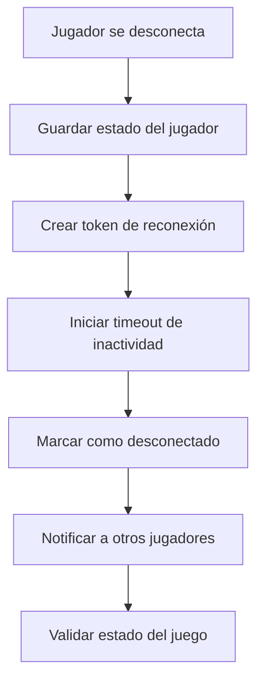
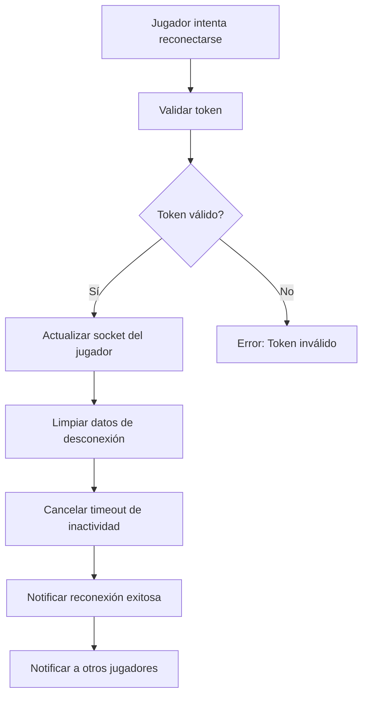
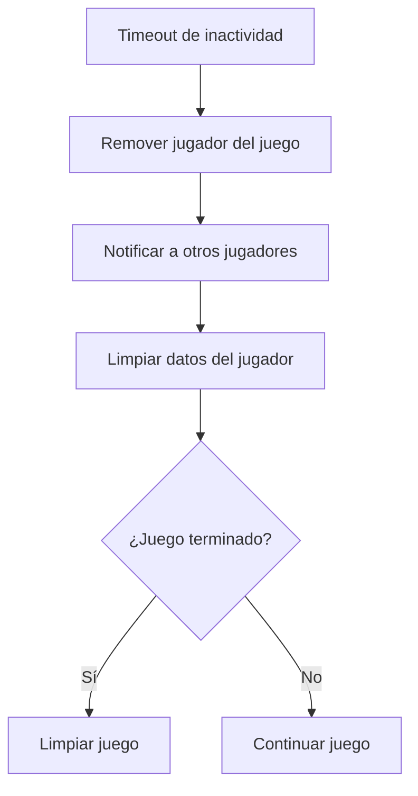

# 🔌 Sistema de Gestión de Conexiones - Torre de los Pecados

## 📋 Resumen

Este documento describe el sistema mejorado de gestión de conexiones y desconexiones implementado en Torre de los Pecados. El sistema permite a los jugadores reconectarse a sus partidas, maneja timeouts automáticos y mantiene la integridad del juego.

---

## 🎯 Características Principales

### ✅ Reconexión de Jugadores
- **Tokens de reconexión**: Cada jugador recibe un token único al desconectarse
- **Ventana de reconexión**: 60 segundos para reconectarse antes de ser removido
- **Estado preservado**: El jugador mantiene su posición y cartas durante la desconexión

### ✅ Sistema de Timeouts
- **Timeout de turno**: 30 segundos por turno antes de pasar automáticamente
- **Timeout de inactividad**: 2 minutos de inactividad antes de remover al jugador
- **Timeout de reconexión**: 1 minuto para reconectarse antes de perder la partida

### ✅ Validación de Estado
- **Verificación automática**: El sistema valida el estado del juego cada hora
- **Corrección de inconsistencias**: Ajusta índices y estados automáticamente
- **Limpieza de recursos**: Elimina juegos terminados y salas vacías

---

## 🔧 Implementación Técnica

### Estructuras de Datos

```javascript
// Tokens de reconexión
playerReconnectionTokens = new Map(); // Map<playerId, {token, expiresAt, roomId}>

// Jugadores desconectados
disconnectedPlayers = new Map(); // Map<playerId, {roomId, disconnectedAt, gameState}>

// Timeouts de inactividad
playerTimeouts = new Map(); // Map<playerId, timeoutId>
```

### Configuración de Timeouts

```javascript
TURN_TIMEOUT = 30000;        // 30 segundos por turno
RECONNECTION_TIMEOUT = 60000; // 1 minuto para reconexión
INACTIVE_TIMEOUT = 120000;    // 2 minutos de inactividad
```

---

## 📡 Flujo de Conexión/Desconexión

### 1. Desconexión del Jugador



**Pasos:**
1. Se guarda el estado del jugador en `disconnectedPlayers`
2. Se genera un token único de reconexión
3. Se inicia un timeout de 2 minutos para inactividad
4. El jugador se marca como `isDisconnected = true`
5. Se notifica a otros jugadores sobre la desconexión
6. Se valida el estado del juego

### 2. Reconexión del Jugador



**Pasos:**
1. El jugador envía su `playerId` y `token`
2. Se valida el token contra `playerReconnectionTokens`
3. Se actualiza el `socketId` del jugador
4. Se limpian los datos de desconexión
5. Se cancela el timeout de inactividad
6. Se notifica la reconexión exitosa

### 3. Timeout de Inactividad



---

## 🎮 Eventos Socket.io

### Eventos de Desconexión

```javascript
// Emitido cuando un jugador se desconecta
socket.to(roomId).emit('playerDisconnected', {
  playerId: string,
  playerName: string,
  message: 'Jugador desconectado - puede reconectarse'
});
```

### Eventos de Reconexión

```javascript
// Emitido al jugador que se reconecta exitosamente
socket.emit('reconnectionSuccess', {
  gameState: GameState,
  message: 'Reconexión exitosa'
});

// Emitido a otros jugadores cuando alguien se reconecta
socket.to(roomId).emit('playerReconnected', {
  playerId: string,
  playerName: string
});
```

### Eventos de Timeout

```javascript
// Emitido cuando un jugador es removido por inactividad
socket.to(roomId).emit('playerInactive', {
  playerId: string,
  playerName: string,
  message: 'Jugador removido por inactividad'
});

// Emitido cuando un jugador es removido por desconexión prolongada
socket.to(roomId).emit('playerRemoved', {
  playerId: string,
  playerName: string,
  message: 'Jugador removido por desconexión prolongada'
});
```

---

## 🛠️ Métodos del GameService

### `createReconnectionToken(playerId, roomId)`
Crea un token único para reconexión con tiempo de expiración.

### `validateReconnectionToken(playerId, token)`
Valida si un token de reconexión es válido y no ha expirado.

### `handleReconnection(socket, data)`
Maneja el proceso de reconexión de un jugador.

### `startInactivityTimeout(playerId, roomId)`
Inicia un timeout de inactividad para un jugador.

### `handlePlayerInactivity(playerId, roomId)`
Maneja la inactividad de un jugador removiéndolo del juego.

### `validateGameState(roomId)`
Valida y corrige el estado del juego automáticamente.

---

## 🔄 Limpieza Automática

### Proceso de Limpieza (cada hora)

1. **Jugadores desconectados**: Remueve jugadores desconectados por más de 5 minutos
2. **Juegos terminados**: Limpia juegos terminados hace más de 1 hora
3. **Salas vacías**: Elimina salas en espera sin jugadores
4. **Validación de estado**: Verifica la integridad de juegos activos

### Configuración de Limpieza

```javascript
// Limpieza cada hora
setInterval(() => {
  gameService.cleanupOldGames();
}, 60 * 60 * 1000);

// Timeouts de limpieza
const fiveMinutesAgo = new Date(now.getTime() - 5 * 60 * 1000);
const oneHourAgo = new Date(now.getTime() - 60 * 60 * 1000);
```

---

## 🎯 Beneficios del Sistema

### Para los Jugadores
- ✅ **Reconexión automática**: No pierden su partida por desconexiones temporales
- ✅ **Estado preservado**: Mantienen su posición y cartas
- ✅ **Notificaciones claras**: Saben cuándo pueden reconectarse
- ✅ **Tiempo suficiente**: 1 minuto para reconectarse

### Para el Sistema
- ✅ **Integridad del juego**: Mantiene la consistencia del estado
- ✅ **Limpieza automática**: Elimina recursos no utilizados
- ✅ **Escalabilidad**: Maneja múltiples desconexiones simultáneas
- ✅ **Monitoreo**: Logs detallados para debugging

### Para la Experiencia
- ✅ **Juegos más estables**: Menos interrupciones por desconexiones
- ✅ **Mejor UX**: Los jugadores no pierden progreso
- ✅ **Comunidad más activa**: Menos frustración por desconexiones
- ✅ **Competición justa**: No se penaliza por problemas de conexión

---

## 🚀 Próximas Mejoras

### Fase 2: IA y Juego Contra Computadora
- [ ] **IA de reemplazo**: IA temporal para jugadores desconectados
- [ ] **Modo espectador**: Permitir ver partidas mientras se reconecta
- [ ] **Notificaciones push**: Alertas cuando es tu turno

### Fase 3: Experiencia de Usuario
- [ ] **Indicador de conexión**: Mostrar estado de conexión en tiempo real
- [ ] **Reconexión automática**: Reconectar automáticamente al cargar la página
- [ ] **Modo offline**: Guardar estado localmente

### Fase 4: Autenticación y Usuarios
- [ ] **Persistencia de sesión**: Mantener sesión entre reconexiones
- [ ] **Historial de desconexiones**: Estadísticas de estabilidad de conexión
- [ ] **Preferencias de timeout**: Configurar timeouts personalizados

---

## 📊 Métricas de Monitoreo

### KPIs de Conexión
- **Tasa de reconexión**: > 80% de jugadores se reconectan exitosamente
- **Tiempo promedio de reconexión**: < 30 segundos
- **Desconexiones por partida**: < 2 por partida promedio
- **Jugadores removidos por inactividad**: < 5% del total

### Logs de Monitoreo
```javascript
// Logs de reconexión
console.log(`✅ ${player.name} se reconectó a la sala ${roomId}`);
console.log(`📡 ${player.name} desconectado de la sala ${roomId}`);
console.log(`⏰ Jugador ${player.name} inactivo, removiendo del juego`);
console.log(`🧹 Removiendo jugador desconectado permanentemente: ${player.name}`);
```

---

*¡Que la conexión esté siempre de tu lado! 🔌🎮*
